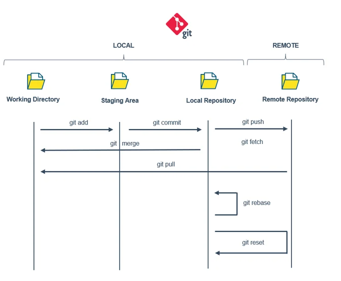

# Table of Contents

- [Table of Contents](#table-of-contents)
- [01. Introduction to Git and GitHub](#01-introduction-to-git-and-github)
  - [What is Git?](#what-is-git)
  - [What is GitHub?](#what-is-github)
  - [Key Difference](#key-difference)
- [02. Important Terminology](#02-important-terminology)
- [03. GitHub-Specific Terms](#03-github-specific-terms)
- [04. Git Configuration (Quick Setup)](#04-git-configuration-quick-setup)
- [05. Git Standard Workflow](#05-git-standard-workflow)
  - [1. Working Directory](#1-working-directory)
  - [2. Staging Area](#2-staging-area)
  - [3. Local Repository](#3-local-repository)
  - [4. Remote Repository](#4-remote-repository)

# 01. Introduction to Git and GitHub

## What is Git?

- **Git** is a **version control system (VCS)**. It is a software.
- It helps you **track changes** in your code or project files.
- You can **go back to previous versions**, **compare changes**, and **collaborate** with others without overwriting each other’s work.
- It works locally on your computer but can also connect to remote repositories (like GitHub).

👉 Example:

- You write code today → Git saves it as a snapshot (commit).
- Tomorrow you update → Git saves another snapshot.
- You can then move between versions, undo mistakes, or merge changes with a teammate’s code.

---

## What is GitHub?

- **GitHub** is a **platform/service** built on top of Git.
- It’s like a **social network + cloud storage for code**.
- It hosts your Git repositories online so you and your team can collaborate from anywhere.
- GitHub adds extra features: **pull requests, issues, project boards, actions (CI/CD), profile/portfolio**.

👉 Example:

- You upload your Git project to GitHub → your teammate clones it.
- They make changes → push back to GitHub.
- You review and merge their changes.

---

## Key Difference

- **Git** = the tool you use on your computer (command-line or GUI) to manage code history.
- **GitHub** = a website/platform that stores and shares your Git repositories online.

---

⚡ Quick Analogy:

- Git is like **MS Word’s Track Changes** for coding projects.
- GitHub is like **Google Drive** where you upload and share those Word files with others.

# 02. Important Terminology

1. **Repository (Repo)**

   A folder where your project and its history are stored.

2. **Commit**

   A saved snapshot of your project at a specific time.

3. **Branch**

   A separate line of development — like a copy of the main code where you can test changes.

4. **Merge**

   Combining changes from one branch into another (e.g., feature branch → main branch).

5. **Clone**

   Making a full copy of a GitHub repository onto your local computer.

6. **Pull**

   Downloading the latest changes from GitHub to your local repo.

7. **Push**

   Uploading your changes from local Git to GitHub.

8. **Fork**

   Your personal copy of someone else’s GitHub repo (used to contribute or experiment).

9. **Pull Request (PR)**

   A request to merge your changes into another branch/repo (often reviewed before merging).

10. **Staging Area (Index)**

    A temporary space where files are kept before committing.

11. **HEAD**

    A pointer showing the current branch/commit you’re working on.

12. **Remote**

    The online version of your repo (like on GitHub).

13. **Origin**

    The default name Git gives to the remote repository you cloned from.

14. **Conflict (Merge Conflict)**

    Happens when two people change the same part of a file, and Git asks you to decide which version to keep.

15. **.gitignore**

    A file that tells Git which files/folders to skip (e.g., temp files, passwords).

---

# 03. GitHub-Specific Terms

1. **Issues**

   A way to track bugs, tasks, or feature requests.

2. **Actions (CI/CD)**

   Automations to build, test, or deploy your project directly from GitHub.

3. **Wiki**

   A documentation area inside a GitHub repo.

4. **Star**

   A way to bookmark or show appreciation for a repository.

5. **Watch**

   Get notified when a repo has updates.

---

# 04. Git Configuration (Quick Setup)

1. **Check Git version**

```bash
git --version
```

2. **Set your identity**

```bash
git config --global user.name "Your Name"
git config --global user.email "youremail@example.com"
```

3. **Set default branch (optional)**

```bash
git config --global init.defaultBranch main
```

4. **Set default editor (optional)**

```bash
git config --global core.editor "code --wait"
```

5. **Check settings**

```bash
git config --list
```

---

# 05. Git Standard Workflow

In a typical Git Workflow, there are four core components:

## 1. Working Directory

- Current state of the Git directory.
- Contains new files that are not yet tracked and files modified since the last version.

## 2. Staging Area

- The intermediate zone between the working directory and the repository.
- It contains the changes made in the working directory that Git will add to the repository during the next commit.

## 3. Local Repository

- A working local copy of a remote repository.
- Stores the committed history of the project.

## 4. Remote Repository

- Files stored remotely in platforms like **GitHub**, **GitLab**, or **Azure DevOps**.
- Allows collaboration and sharing of code with others.


