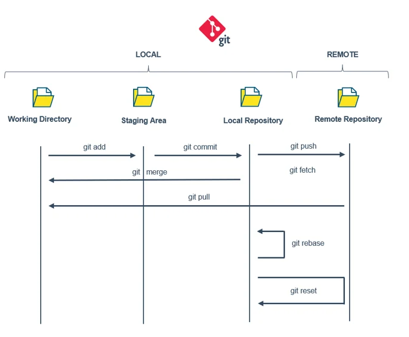
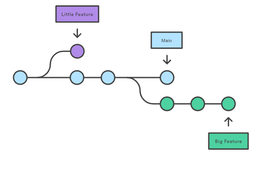

# Table of Contents

- [Table of Contents](#table-of-contents)
- [01. Introduction to Git and GitHub](#01-introduction-to-git-and-github)
  - [What is Git?](#what-is-git)
  - [What is GitHub?](#what-is-github)
  - [Key Difference](#key-difference)
- [02. Important Terminology](#02-important-terminology)
- [03. GitHub-Specific Terms](#03-github-specific-terms)
- [04. Git Configuration (Quick Setup)](#04-git-configuration-quick-setup)
- [05. Git Standard Workflow](#05-git-standard-workflow)
  - [1. Working Directory](#1-working-directory)
  - [2. Staging Area](#2-staging-area)
  - [3. Local Repository](#3-local-repository)
  - [4. Remote Repository](#4-remote-repository)
  - [](#)
- [06. Git Branch](#06-git-branch)
  - [🔹 What is a Branch?](#-what-is-a-branch)
  - [🔹 How Branch Works](#-how-branch-works)
  - [🔹 Common Branch Commands](#-common-branch-commands)
  - [🔹 Example Workflow](#-example-workflow)

# 01. Introduction to Git and GitHub

## What is Git?

- **Git** is a **version control system (VCS)**. It is a software.
- It helps you **track changes** in your code or project files.
- You can **go back to previous versions**, **compare changes**, and **collaborate** with others without overwriting each other’s work.
- It works locally on your computer but can also connect to remote repositories (like GitHub).

👉 Example:

- You write code today → Git saves it as a snapshot (commit).
- Tomorrow you update → Git saves another snapshot.
- You can then move between versions, undo mistakes, or merge changes with a teammate’s code.

---

## What is GitHub?

- **GitHub** is a **platform/service** built on top of Git.
- It’s like a **social network + cloud storage for code**.
- It hosts your Git repositories online so you and your team can collaborate from anywhere.
- GitHub adds extra features: **pull requests, issues, project boards, actions (CI/CD), profile/portfolio**.

👉 Example:

- You upload your Git project to GitHub → your teammate clones it.
- They make changes → push back to GitHub.
- You review and merge their changes.

---

## Key Difference

- **Git** = the tool you use on your computer (command-line or GUI) to manage code history.
- **GitHub** = a website/platform that stores and shares your Git repositories online.

---

⚡ Quick Analogy:

- Git is like **MS Word’s Track Changes** for coding projects.
- GitHub is like **Google Drive** where you upload and share those Word files with others.

# 02. Important Terminology

| Term                      | Definition                                                                 |
| ------------------------- | -------------------------------------------------------------------------- |
| Repository (Repo)         | A folder where your project and its history are stored.                    |
| Commit                    | A saved snapshot of your project at a specific time.                       |
| Branch                    | A separate line of development — like a copy of the main code for testing. |
| Merge                     | Combining changes from one branch into another.                            |
| Clone                     | Making a full copy of a GitHub repository onto your local computer.        |
| Pull                      | Downloading the latest changes from GitHub to your local repo.             |
| Push                      | Uploading your changes from local Git to GitHub.                           |
| Fork                      | Your personal copy of someone else’s repo (to contribute or experiment).   |
| Pull Request (PR)         | A request to merge your changes into another branch/repo.                  |
| Staging Area (Index)      | Temporary space where files are kept before committing.                    |
| HEAD                      | A pointer showing the current branch/commit you’re working on.             |
| Remote                    | The online version of your repo (like on GitHub).                          |
| Origin                    | The default name Git gives to the remote repository you cloned from.       |
| Conflict (Merge Conflict) | When two people edit the same part of a file, Git asks to resolve.         |
| .gitignore                | A file that tells Git which files/folders to skip.                         |

---

# 03. GitHub-Specific Terms

| Term            | Definition                                               |
| --------------- | -------------------------------------------------------- |
| Issues          | A way to track bugs, tasks, or feature requests.         |
| Actions (CI/CD) | Automations to build, test, or deploy your project.      |
| Wiki            | A documentation area inside a GitHub repo.               |
| Star            | A way to bookmark or show appreciation for a repository. |
| Watch           | Get notified when a repository has updates.              |

# 04. Git Configuration (Quick Setup)

1. **Check Git version**

```bash
git --version
```

2. **Set your identity**

```bash
git config --global user.name "Your Name"
git config --global user.email "youremail@example.com"
```

3. **Set default branch (optional)**

```bash
git config --global init.defaultBranch main
```

4. **Set default editor (optional)**

```bash
git config --global core.editor "code --wait"
```

5. **Check settings**

```bash
git config --list
```

---

# 05. Git Standard Workflow

In a typical Git Workflow, there are four core components:

## 1. Working Directory

- Current state of the Git directory.
- Contains new files that are not yet tracked and files modified since the last version.

## 2. Staging Area

- The intermediate zone between the working directory and the repository.
- It contains the changes made in the working directory that Git will add to the repository during the next commit.

## 3. Local Repository

- A working local copy of a remote repository.
- Stores the committed history of the project.

## 4. Remote Repository

- Files stored remotely in platforms like **GitHub**, **GitLab**, or **Azure DevOps**.
- Allows collaboration and sharing of code with others.

## 

# 06. Git Branch

## 🔹 What is a Branch?

- A **branch** is like a separate **line of development** in Git. (Lets say it a different timeline)
- By default, Git creates a branch called `main` (or `master`).
- You can make new branches to work on **features, bug fixes, or experiments** without affecting the main code.
  

👉 **Analogy:**

Think of a branch as a **parallel copy of your project**. You can work on it independently, and later merge it back into the main project.

---

## 🔹 How Branch Works

1. You create a new branch (copy of current code).
2. Work on it (add/commit changes).
3. Switch between branches as needed.
4. Merge the branch back into `main` when done.

---

## 🔹 Common Branch Commands

| Command                       | Description                                       |
| ----------------------------- | ------------------------------------------------- |
| `git branch`                  | List all branches in the repo.                    |
| `git branch branch_name`      | Create a new branch.                              |
| `git checkout branch_name`    | Switch to an existing branch.                     |
| `git checkout -b branch_name` | Create **and** switch to a new branch (shortcut). |
| `git merge branch_name`       | Merge another branch into the current branch.     |
| `git branch -d branch_name`   | Delete a branch (after merge).                    |
| `git branch -D branch_name`   | Force delete a branch.                            |
| `git switch branch_name`      | (Newer alternative to checkout) Switch branches.  |
| `git switch -c branch_name`   | Create + switch branch (same as checkout -b).     |

---

## 🔹 Example Workflow

```bash
git branch feature-login        # create a new branch
git checkout feature-login      # switch to it
# (make changes, add, commit)
git checkout main               # go back to main
git merge feature-login         # merge feature into main
git branch -d feature-login     # delete the branch

```

---
